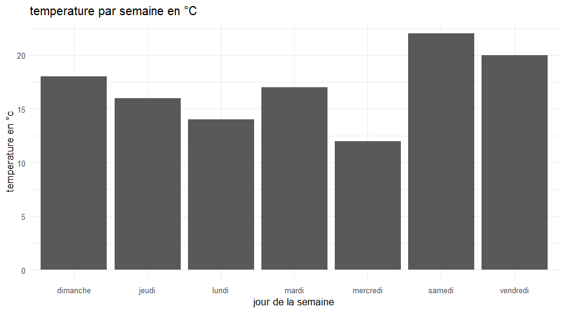
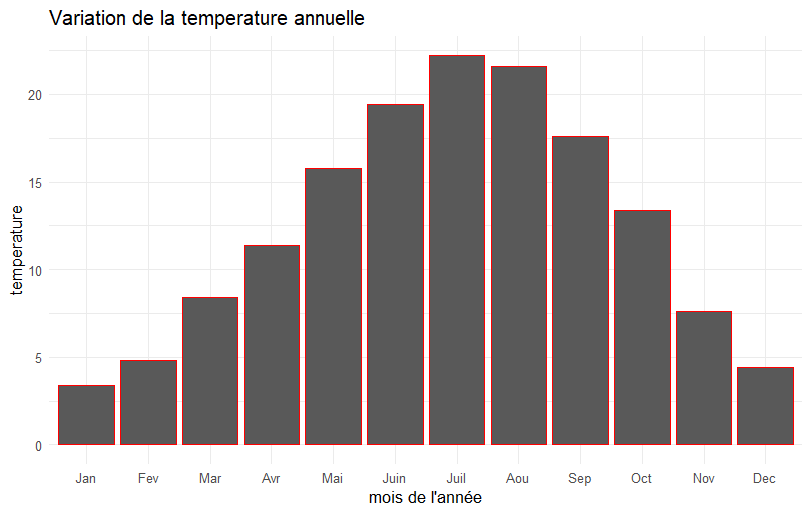
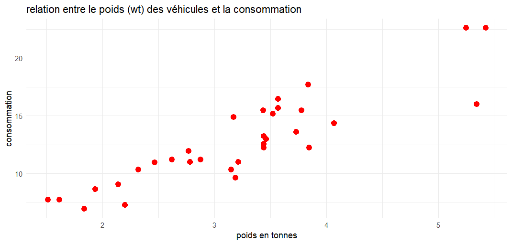

# TP1 R : Manipulation de données et visualisation


Ce dépôt contient les solutions pour une série d'exercices en R couvrant les bases de la manipulation de données et de la visualisation.

## 📋 Table des matières
- [Exercices](#-exercices)
- [Prérequis](#-prérequis)
- [Installation](#-installation)
- [Utilisation](#-utilisation)
- [Résultats](#-résultats)
- [Auteur](#-auteur)

## 📚 Exercices

### Exercice 1 : Vecteurs de base
- Création d'un vecteur de nombres pairs de 2 à 10
- Calcul de la somme et de la moyenne des valeurs

### Exercice 2 : Conversion de température
- Conversion de Fahrenheit en Celsius pour des données hebdomadaires
- Analyse statistique (min, max, moyenne)
- Visualisation avec ggplot2



### Exercice 3 : Gestion des valeurs manquantes
- Calculs statistiques (min, max, moyenne) avec gestion des NA

### Exercice 4 : Analyse climatique
- Calcul des températures et précipitations mensuelles
- Visualisation des données climatiques




### Exercice 5 : Calcul de revenus
- Calcul du revenu total et par personne pour des ménages

### Exercice 6 : Exploration de données mtcars
- Manipulation du dataset mtcars
- Conversion mpg → L/100km
- Analyse statistique
- Visualisation des relations entre variables



## ⚙️ Prérequis
- R (version 4.0 ou supérieure)
- Packages ggplot2, dplyr

## 📥 Installation
1. Clonez ce dépôt :
```bash
# git clone https://github.com/votreuser/TP1-R.git