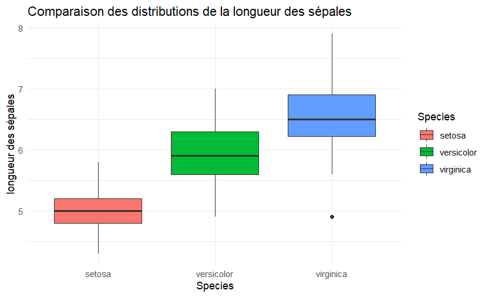
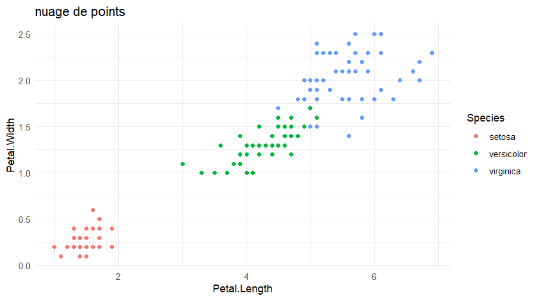

# Projet d'analyse : Iris de Fisher


Une analyse complète du célèbre jeu de données Iris de Fisher, incluant exploration statistique, visualisations et classification par k-NN.

## 📋 Table des matières
- [Description du projet](#-description-du-projet)
- [Résultats clés](#-résultats-clés)
- [Visualisations](#-visualisations)
- [Méthodologie](#-méthodologie)
- [Comment exécuter](#-comment-exécuter)
- [Dépendances](#-dépendances)

## 📝 Description du projet

Ce projet analyse le jeu de données Iris qui contient :
- 150 observations de fleurs d'iris
- 3 espèces (Setosa, Versicolor, Virginica)
- 4 caractéristiques mesurées (longueur/largeur des sépales et pétales)

## 🏆 Résultats clés

### Statistiques descriptives
| Caractéristique      | Moyenne | Écart-type |
|----------------------|---------|------------|
| Longueur sépale (cm) | 5.84    | 0.83       |
| Largeur sépale (cm)  | 3.06    | 0.44       |
| Longueur pétale (cm) | 3.76    | 1.77       |
| Largeur pétale (cm)  | 1.20    | 0.76       |

### Performance du modèle k-NN
| Valeur de k | Précision |
|-------------|-----------|
| 1           | 96.67%    |
| 3           | 96.67%    |
| 5           | 96.67%    |
| 7           | 93.33%    |

## 📊 Visualisations

### Distribution par espèce


### Relation entre variables


## 🔧 Méthodologie

1. **Exploration des données**
   - Analyse statistique descriptive
   - Vérification des valeurs manquantes

2. **Pré-traitement**
   - Normalisation des données
   - Séparation train/test (80%/20%)

3. **Modélisation**
   - Implémentation de l'algorithme k-NN
   - Évaluation avec différentes valeurs de k

4. **Validation**
   - Matrice de confusion
   - Calcul de la précision

## 🚀 Comment exécuter

1. Clonez le dépôt :
```bash
# git clone https://github.com/votreutilisateur/iris-analysis.git