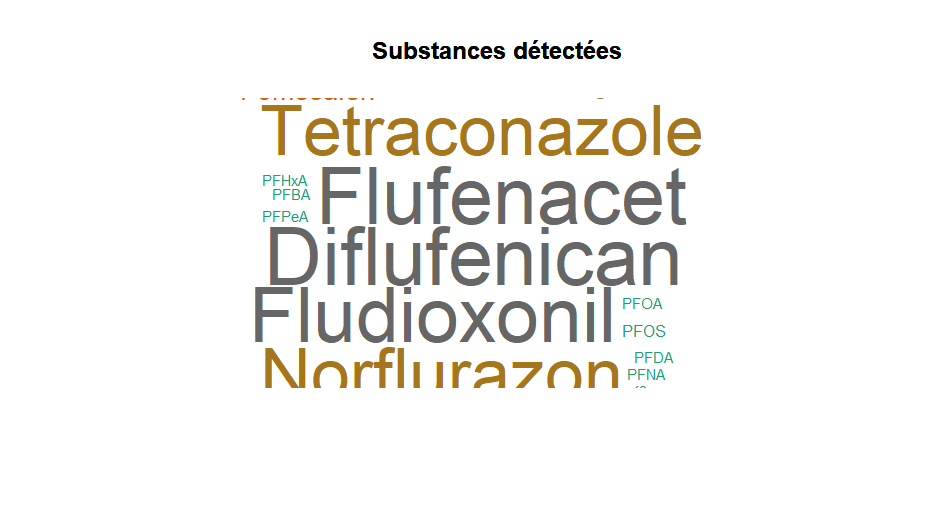

# Analyse des données PFAS en France

Ce projet analyse des données de prélèvements de substances per- et polyfluoroalkylées (PFAS) en France.

## Fichiers inclus

- `data4.csv` : Fichier CSV final contenant les données analysées
- `pfas_analysis.R` : Script R contenant le code d'analyse
- `wordcloud.png` : Nuage de mots des substances les plus fréquentes

## Méthodologie

### 1. Analyse initiale des données
- Exploration de la structure des données (lignes, colonnes)
- Vérification de la couverture géographique et temporelle
- Statistiques descriptives par source de prélèvement

### 2. Nettoyage des données
- Standardisation des noms de villes
- Gestion des valeurs manquantes
- Suppression des colonnes non informatives

### 3. Analyse approfondie
- Extraction des valeurs PFAS depuis le format JSON
- Identification des substances les plus fréquentes
- Analyse spécifique pour la ville de Dijon
- Classement des villes par concentration totale de PFAS

### 4. Visualisation
- Génération d'un nuage de mots pour les substances détectées

## Résultats clés

1. **Sources de prélèvement** : 5 types identifiés (Drinking water, Surface water, etc.)
2. **Substances les plus fréquentes** : PFOS, PFOA, PFHxS, PFNA, PFDA
3. **Villes les plus concernées** : [Liste des villes avec les plus hautes concentrations]
4. **Données Dijon** : X substances détectées, principalement [substances principales]

## Prérequis

- R (version 4.0 ou supérieure)
- Packages R :
  - `jsonlite`
  - `tidyverse`
  - `tm`
  - `wordcloud`
  - `RColorBrewer`

## Exécution

1. Télécharger les fichiers du projet
2. Ouvrir le script `pfas_analysis.R` dans R/RStudio
3. Exécuter le script ligne par ligne ou en entier
4. Les résultats seront affichés dans la console et le fichier `data4.csv` sera généré

## Auteur

MOMBOULI Trinité

